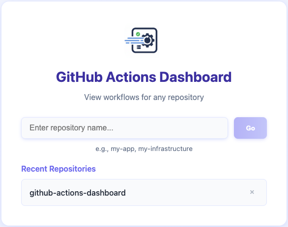

# GitHub Actions Dashboard

A simple local dashboard to search, filter, pin, and jump to GitHub Actions workflows and their recent runs. Runs in a Docker container and authenticates to GitHub via your Personal Access Token (PAT).



## Features
- 🔍 **Search workflows** by name or path
- 📌 **Pin frequently used workflows** for quick access
- 🎯 **Toggle "pinned only" view** to focus on your favorites
- 🚦 **See latest run status** badge per workflow
- 📊 **View recent runs** in a detailed modal
- 🔗 **Jump directly to GitHub** for any workflow or run


## Requirements
- Docker and Docker Compose
- GitHub PAT with `repo` and `workflow` scopes for private repos; `workflow` may be sufficient for public

## Environment Variables
- `GITHUB_OWNER`: Repository owner/organization (e.g., `your-org`)
- `GITHUB_TOKEN`: Your GitHub PAT (obtainable via `gh auth token`)

## Quick Start
Use `gh auth token` to get your GitHub token and pass it directly:

```sh
GITHUB_TOKEN=$(gh auth token) GITHUB_OWNER="your-org" docker compose up --build -d
```

Open: http://localhost:3000

The app will prompt you to enter a repository name. Pins are persisted in a Docker volume `pins-data`.

### Viewing Workflow Details

Click on any workflow to see a detailed drilldown of recent runs with their status, timing, and direct links to GitHub.


## Local Dev (without Docker)
Backend:
```sh
cd backend
npm install
npm run dev
```
Frontend:
```sh
cd Technology Stack
- **Frontend**: React + TypeScript + Vite
- **Backend**: Node.js + Express + TypeScript
- **Database**: SQLite (for pinned workflows)
- **Deployment**: Docker + Docker Compose

## Notes
- API rate limits apply. The backend caches workflow list for 60s.
- The dashboard uses GitHub REST API v3 endpoints:
  - List workflows: `GET /repos/{owner}/{repo}/actions/workflows`
  - List runs: `GET /repos/{owner}/{repo}/actions/workflows/{workflow_id}/runs`

## Contributing
Contributions are welcome! Please feel free to submit a Pull Request.

## License
MITe Docker which does that automatically.

## Notes
- API rate limits apply. The backend caches workflow list for 60s.
- The dashboard uses GitHub REST API v3 endpoints:
  - List workflows: `GET /repos/{owner}/{repo}/actions/workflows`
  - List runs: `GET /repos/{owner}/{repo}/actions/workflows/{workflow_id}/runs`

## Security
- The token is only used server-side in the backend container.
- No token is exposed to the browser.
